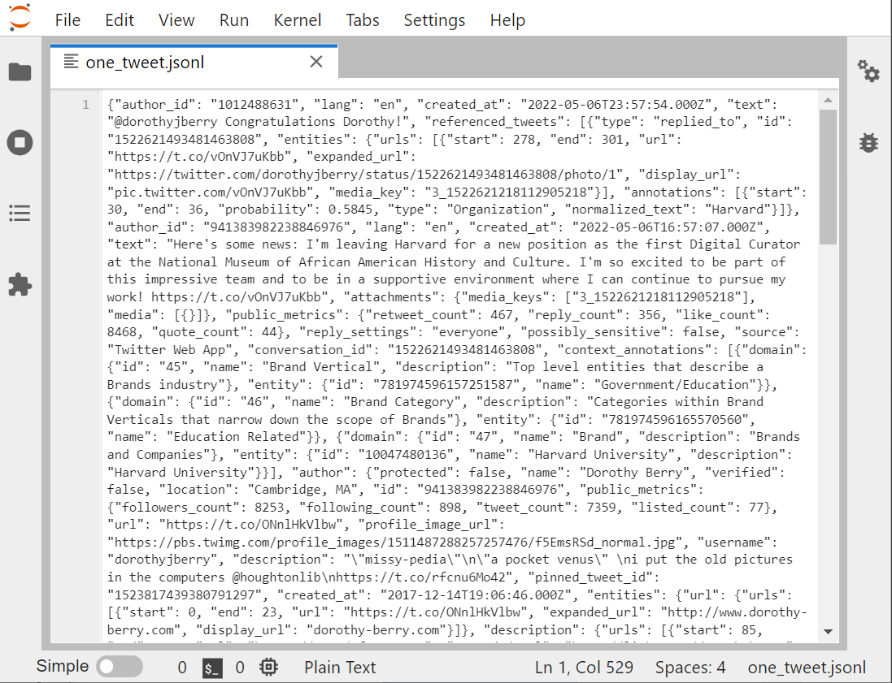
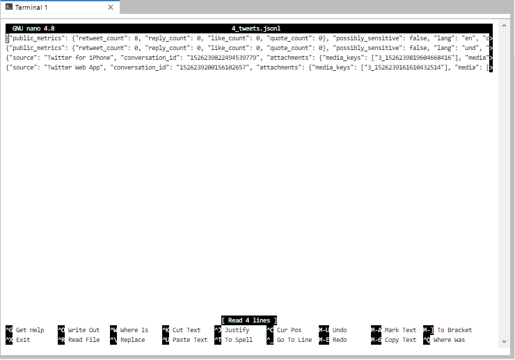
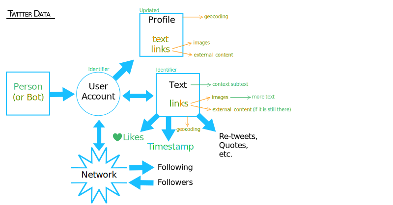

# Examining a twarc JSONL file

JSONL, Line-oriented JavaScript Object Notation, is frequently used as a
data interchange format. It has become super common in the data science
field, and you will encounter it frequently. 

Let's look at one individual tweet file, in the Jupyter viewer.

There are several other ways to look at any text file in the Jupyter environment:
1 Run the `cat` Bash command. That's not so readable
1 Open the file with the nano editor: nano opens files unwrapped, so you can see the lines.
1 Jupyter text viewer/editor

The Jupyter viewer/editor has numbering, so we can see that this whole screen
is one line. Looking at the beginning of the file, if you insert some returns and
some tables, it will help you to see that JSON is a
whole bunch of named-value pairs? ie:

~~~
"name": "Joe Gaucho",
"address": "123 Del Playa",
"age": 23,
"email": "jgaucho@ucsb.edu",
~~~
{: .output}

You can see that the key is in quotes, then there's a
colon, then the value. If the value is text, that's going to be in quotes too.

Both nano and the Jupyter editor allows us to format the text with
returns and indents, so that the individual named-value pairs are easier to identify.

Just to show you the the contents of a single tweet, look to the output below. The 
output is an edit of the data with only white-space characters. These edits have been 
made to explore and separate the tweet's content from the metadata.

We can see that the 4th piece of data in the tweet is "text", and is
after the author's ID, the language, and time stamp. The fifth
element, "referenced tweet", tells us that this tweet is in reply to another tweet.

~~~
{"data": [{"author_id": "1012488631",
"lang": "en",
"created_at": "2022-05-06T23:57:54.00Z",
"text": "@dorothyjberry Congratulations Dorothy!",
"referenced_tweets": [{"type": "replied_to",
                       "id": "1522621493481463808"}],
"entities":
    {"mentions":
        [{"start": 0,
          "end": 14,
          "username": "dorothyjberry",
          "id" : "941383982238846976"}],
     "annotations": [{"start": 31, "end": 37,
          "probability": 0.8784,
          "type": "Person", "normalized_text": "Dorothy"}]},
     "in_reply_to_user_id": "941383982238846976"
     "public_metrics": {"retweet_count": 0,
           "reply_count": 0,
           "like_count": 1,
           "quote_count": 0},
reply_settings": "everyone",
"possible_sensitive": false,
"id": "1522727385380143105",
"source": "Twitter Web App",
"conversation_id": "1522621493481463808"},
~~~
{: .output}

There are many, many elements attached to each Tweet. You will probably never use
most of them.

Some key pieces of a Tweet are:
- created_at: the exact day and time (in GMT) the tweet was posted
- id: a unique tweet ID number
- entities: strings pulled out of a tweet that line up with Twitter's ontology
  - any hashtags that are used
  - any users who are @'ed
  - personal names
- referenced_tweets.retweeted.id' if this is a retweet, this field shows the id of 
  the original tweet.

- user
  - id
  - name
  - screen name (twitter handle)
  - followers_count (at the time the tweet was created)

All of these elements become much more visible if we download our tweet
and open it up with [an online JSONL viewer](https://codebeautify.org/jsonviewer)

We can also see just the name of each field by using the columns
method on any dataframe we have made from Twitter data. For example,
 ecodatasci_df, the dataframe created from the ecodatasci timeline:

~~~
list(bjules_df.columns)
~~~
{: .language-python}

~~~
['id',
 'conversation_id',
 'referenced_tweets.replied_to.id',
 'referenced_tweets.retweeted.id',
 'referenced_tweets.quoted.id',
 'author_id',
 'in_reply_to_user_id',
 'retweeted_user_id',
...
 '__twarc.retrieved_at',
 '__twarc.url',
 '__twarc.version',
 'Unnamed: 73']
~~~
{: .output}

This gives you a sense of just how much data comes along with a tweet. The final three 
entries are added by the Twitter API to let you know how the tweet was retrieved.

## First and last tweets
Let's look at our `bjules_flat.jsonl` file again.

Remember our JSONL files are line-oriented, ie: one tweet per line. Let's use the
`head` and `tail` command to create files with the first and last lines of
our data file.

The double-greater-than `>>` appends rather than creates. 

~~~
!head -n 2 'output/bjules_flat.jsonl' > 'output/2_tweets.jsonl'
~~~
{: .language-bash}

~~~
!tail -n 2 'output/bjules_flat.jsonl' >> 'output/2_tweets.jsonl'
~~~
{: .language-bash}

If we use `! cat` to output the files, we see a real
mess. Let's open the Jupyter graphical file viewer instead.

> ## Why not use nano?
>
> Nano, which we can call from the shell window, is a great way
> to stay in our little shell window
> with our hands on our keyboards.  However, we are going to spend
> our workshop in Jupyter to make our work more reproducible.
>
> However, sometimes it's going to be advantageous to
> look at a file in nano, because the JSONL files open with lines
> unwrapped.
> Our 2-tweets file, for example
> {: .source}
{: .callout}

Using either method, it's still difficult to tell what's going on. Can
we even tell where one tweet ends, and the second begins? Jupyter
does have line numbers, so at least we can see 
it's 2 lines.

With the lines unwrapped, you can advance across the line to see
the posted date of the action on the timeline, as well as what type of
action it was. 

With the first and last tweets, that gives us the 
the date and time range of what we retrieved from Mr. Jules' timeline:

#FIXME you need a new 2-tweet version

# A Very Basic Analysis

One goal for us is to look at our data without looking at the JSONL 
directly. When we harvest tweets, it is a very good idea to do a little exploratory,
reality-checking, analysis to make sure you got what you expected. As we did in the previous
episode, let's look at 
the bash command `wc` (word count) to see how many lines of JSONL,
therefore how many tweets, are in
our gas prices file. Don't forget to flatten it first!

~~~
! twarc2 flatten raw/hashtag_gas.jsonl output/hashtag_gas_flat.jsonl
! wc output/hashtag_gas_flat.jsonl
~~~
{: .language-python}

~~~
15698   7653538 100048736 hashtag_gas_flat.jsonl
~~~
{: .output}

We can then look at the timestamps of the first and last tweets to determine
the date range of our tweets by using the `head` and `tail` commands to
get the first line and last line of the file:
~~~
!head -n 1 'output_data/hashtag_gas_flat.jsonl'
!tail -n 1 'output_data/hashtag_gas_flat.jsonl'
~~~
{: .bash}

Lets save this output into a file named "gas_date_range.jsonl":

~~~
!head -n 1 'output/hashtag_gasprices_flat.jsonl' > 'output/gasprice_range.jsonl'
!tail -n 1 'raw/hashtag_gasprices_flat.jsonl' >> 'output/gasprice_range.jsonl'
~~~
{: .bash}

#FIXME : let's make objects or files for these that have the date
ranges pulled out.

Let’s go back and do this basic analysis for our two other files of raw data: bjules.jsonl and
 ecodatasci.jsonl (or whatever timeline you downloaded in the episode 2 challenge).

> ## Challenge: Getting Date Ranges
> Please create the files `bjules_range.jsonl` and `ecodatasci_range.jsonl` that
> contains the first and last tweets of bjules.jsonl and ecodatasci.jsonl.  Use
> one notebook cell per file.
>
> Remember to specify where to store your output files.
>
> Output your answers in your notebook by creating objects and outputting
> them to an output cell using #FIXME ... 
> 1. What are the oldest and newest items on Bergis' timeline.
> 1. How many items are on Bergis' timeline?
> 2. Same questions for the timeline you downloaded in episode 2.
> 
> > ## Solution
> > #FIXME this solution is not correct. the input file is wrong.
> >
> > ~~~
> > !head -n 1 'raw/bjules.jsonl' > 'output/bjules_range.jsonl'
> > !tail -n 1 'raw/bjules.jsonl' >> 'output/bjules_range.jsonl'
> > !wc 'raw_data/bjules.jsonl'
> > ~~~
> > {: .language-python}
> > We can see that we retrieved Bergis' texts back to 2018.
> >
> > ~~~
> > !head -n 1 'raw/ecodatasci.jsonl' > 'output/ecodatasci_range.jsonl'
> > !tail -n 1 'raw/ecodatasci.jsonl' >> 'output/ecodatasci_range.jsonl'
> > !wc 'raw_data/ecodatasci.jsonl'
> > ~~~
> > {: .language-python}
> >
> {: .solution}
{: .challenge}

Other things we can do: sentiment analysis (FORESHADOWING). See when he joined
Twitter (hint: way before 2018)

## How are the flattened and unflattened versions different? 
Timeline doesn’t really give a
line-oriented set of tweets, this is why we need flatten or csv.
This is partially because there are items other than
Tweets in your timeline.

> ## Challenge: First and last Tweets
>
> Using the terminal or Jupyter, use the commands `head` and `tail` to
> save more than just the first 2 and last 2 tweets in `hashtag_gasprices.jsonl`.
> let's say the first and last 10.
> View the file to determine:
> 1. How long is the time difference between the first and the last tweets?
> 2. Judging by these 20 tweets, do they arrive in chronological order?
> 3. Create a dataframe of these 20 tweets to look at the times in a more friendly way.
>
> ~~~
> !head -n 10 'output/hashtag_gas_flat.jsonl' >  'output/20tweets.jsonl'
> !tail -n 10 'output/hashtag_gas_flat.jsonl' >> 'output/20tweets.jsonl'
> ~~~
> {: .language-python}
>
> > ## Solution
> >
> > 1. First Tweet in the file arrived Mon Apr 18 21:59:14, Final Tweet at Mon Apr 18 18:15:33. So these
> > are Tweets span about 4 hours.
> > 2. Answer: They arrive in reverse-chronological, with the most recent Tweets are on top, oldest at the bottom.
> > ~~~
> > {"created_at": "Mon Apr 18 21:59:14 +0000 2022", "id": 1516174539742494723, ...
> > {"created_at": "Mon Apr 18 21:59:12 +0000 2022", "id": 1516174533732016132, ...
> > {"created_at": "Mon Apr 18 18:15:33 +0000 2022", "id": 1516118249443844102, ...
> > {"created_at": "Mon Apr 18 18:15:33 +0000 2022", "id": 1516118248110100483, ...
> > ~~~
> > {: .output}
> > Well?
> > Can we scroll through and examine it?
> >
> {: .solution}
{: .challenge}


