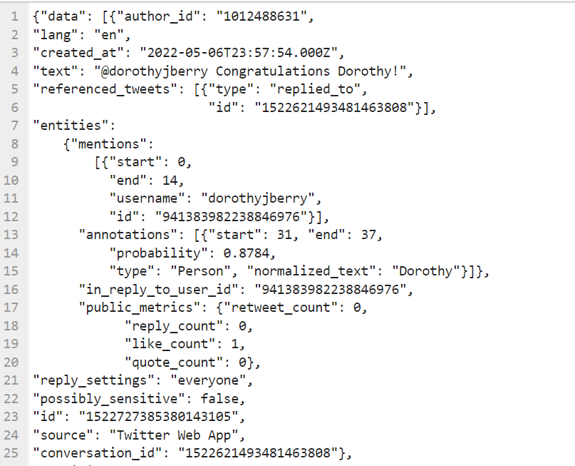
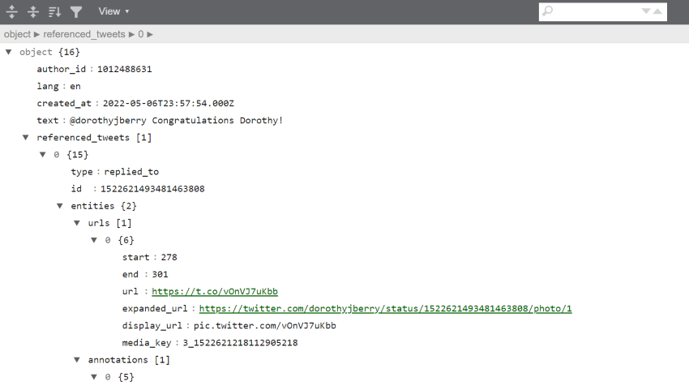

# Examining a twarc JSON file

JSONL, Line-oriented JavaScript Object Notation, is frequently used as a
data interchange format. It has become super common in the data science
field, and you will encounter it frequently. On April 18th, 2022, we
used twarc to search for all mentions of the hashtag `#taxday` (April 15th is
the typical deadline for Americans to file their annual income report,
but in 2022, it was April 18).

Let's look at that individual tweet again.

The Jupyter viewer has numbering, so we can see that this whole screen
is one line. Looking at the beginning of the file, is it obvious that JSON is a
whole bunch of named-value pairs? ie:

~~~
"name": "Joe Gaucho",
"address": "123 Del Playa",
"age": 23,
"email": "jgaucho@ucsb.edu",
~~~
{: .output}

In nano, or in the Jupyter editor, we can start to format this a bit with
returns and indents. You can see that the key is in quotes, then there's a
colon, then the value. If the value is text, that's going to be in quotes too.

Let's crawl along until we find the tweet text itself.

We can see that it is the 4th piece of data in the tweet,
after the author's ID, the language, and the time stamp. The fifth
element tells us that this tweet is in reply to another tweet.

There are many, many elements attached to each Tweet. You will probably never use
most of them.

Some key pieces of a Tweet are:
- created_at: the exact day and time (in GMT) the tweet was posted
- id: a unique tweet ID number
- entities
  -- any hashtags that are used
  -- any users who are @'ed
- user
  -- id
  -- name
  -- screen name (twitter handle)
  -- followers_count

All of these elements become much more visible if we download our tweet
and open it up with [an online JSONL viewer](https://codebeautify.org/jsonviewer)

We can also see just the name of each field by using the columns
method on the dataframe we created in episode 2:

`list(ecodatascience_df.columns)`

(need to write a bit more about the first tweet) #FIXME

Let's look at our `taxday.jsonl` file again.

Remember our JSONL files are line-oriented, ie: one tweet per line. Let's use the
`head` command to create a
file with just two tweets.

~~~
!head -n 2 raw_data/taxday.jsonl > output_data/2_tweets.jsonl
~~~
{: .language-python}

If we use `!cat` to output that file to a Notebook cell, we see a real
mess. Let's open the Jupyter graphical file viewer instead.

> ## Why not use BASH?
>
> We could use nano instead, and stay in our little shell window
> with our hands on our keyboards.  However, we are going to spend
> our workshop in Jupyter to make our work more reproducible.
>
> If you want to keep using nano, feel free.
> {: .source}
{: .callout}

Using either method, it's still difficult to tell what's going on. Can
we even tell where one tweet ends, and the second begins?

# A Very Basic Analysis

When we harvest tweets, it is a very good idea to do a little exploratory
analysis to make sure you got what you expected. As we did in the previous
episode, We can use
the bash command `wc` (word count) to see how many lines of JSON we retrieved,
hence how many tweets we got:

~~~
!wc raw_data/taxday.jsonl
~~~
{: .language-python}

We can then look at the timestamps of the first and last tweets to determine
the date range of our tweets by using the `head` and `tail` commands to
get the first line and last line of the file:
~~~
!head -n 1 raw_data/taxday.jsonl

!tail -n 1 raw_data/taxday.jsonl
~~~
{: .language-python}

lets save this output of taxday.jsonl into a file named taxday_range.jsonl:

~~~
!head -n 1 raw_data/taxday.jsonl > output_data/taxday_range.jsonl
!tail -n 1 raw_data/taxday.jsonl >> output_data/taxday_range.jsonl
!wc taxday.jsonl
~~~
{: .language-python}

Let’s do this basic analysis for our two files: bergis.jsonl, ecodatasci.jsonl.

> ## Challenge: Getting Date Ranges
> Please create the files bergis_range.jsonl and ecodatasci_range.jsonl that contains the first and last tweets of
> bergia.jsonl and ecodatasci.jsonl.  Use one cell per file.
>
> Remember to specify where to store your output files.
>
> > ## Solution
> > ~~~
> > !head -n 1 raw_data/bergis.jsonl > output_data/bergis_range.jsonl
> > !tail -n 1 raw_data/bergis.jsonl >> output_data/bergis_range.jsonl
> > !wc bergis.jsonl
> > ~~~
> > {: .language-python}
> > We can see that we retrieved Bergis' texts back to 2018.
> >
> > ~~~
> > !head -n 1 raw_data/ecodatasci.jsonl > output_data/ecodatasci_range.jsonl
> > !tail -n 1 raw_data/ecodatasci.jsonl >> output_data/ecodatasci_range.jsonl
> > !wc ecodatasci.jsonl
> > ~~~
> > {: .language-python}
> >
> {: .solution}
{: .challenge}

Other things we can do: sentiment analysis (FORESHADOWING). See when he joined
Twitter (hint: way before 2018)

How are the flattened and unflattened versions different? I’m thinking
timeline jsonl looks a tiny bit different from searched/filtered tweets
as jsonl. I can’t confirm yet. Timeline doesn’t really give a
line-oriented set of tweets. <<< this is why we need flatten or csv

# Another Challenge
Use wc and head and tail to figure out how many Tweets you received from
the account you harvested in Episode 2.

> ## First and last Tweets.
>
> Using the terminal or Jupyter, use the commands `head` and `tail` to
> save more than just the first 2 and last 2 tweets in `taxday.jsonl`.
> View the file and determine:
> 1. How long is the time difference between the first and the last tweets?
> 2. Judging by these 4 tweets, do they arrive in chronological order?
> 3. Can you think of a more rigorous way to check?
>
> ~~~
> !head -n 10 taxday.jsonl >  20tweets.jsonl
> !tail -n 10 taxday.jsonl >> 20tweets.jsonl
> ~~~
> {: .language-python}
>
> > ## Solution
> >
> > 1. First Tweet in the file arrived Mon Apr 18 21:59:14, Final Tweet at Mon Apr 18 18:15:33. So these
> > are Tweets span about 4 hours.
> > 2. Answer: They arrive in reverse-chronological, with the most recent Tweets are on top, oldest at the bottom.
> > ~~~
> > {"created_at": "Mon Apr 18 21:59:14 +0000 2022", "id": 1516174539742494723, ...
> > {"created_at": "Mon Apr 18 21:59:12 +0000 2022", "id": 1516174533732016132, ...
> > {"created_at": "Mon Apr 18 18:15:33 +0000 2022", "id": 1516118249443844102, ...
> > {"created_at": "Mon Apr 18 18:15:33 +0000 2022", "id": 1516118248110100483, ...
> > ~~~
> > {: .output}
> > Well?
> > Can we scroll through and examine it?
> >
> {: .solution}
{: .challenge}


