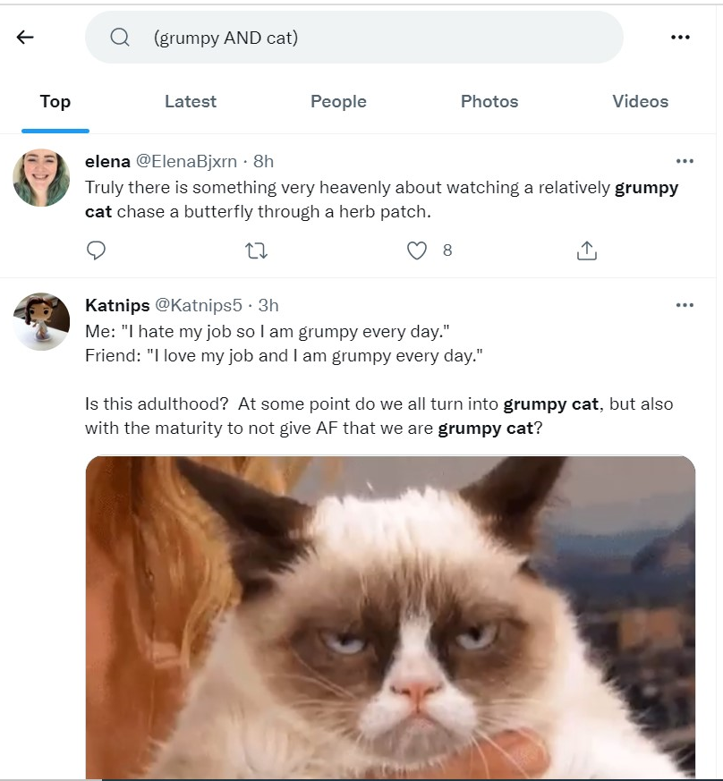
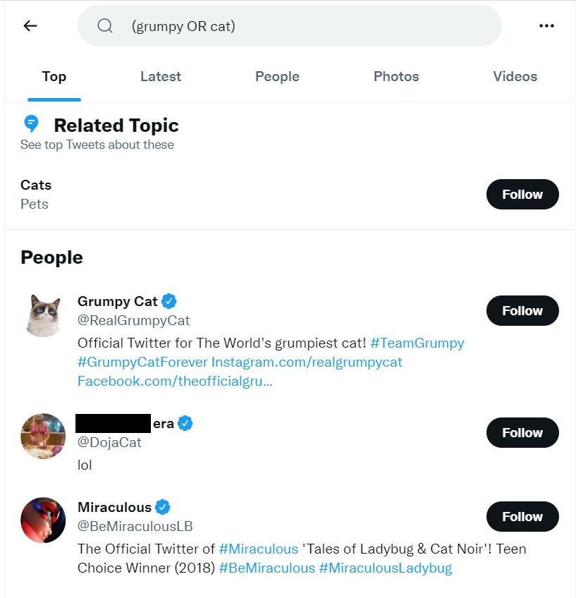
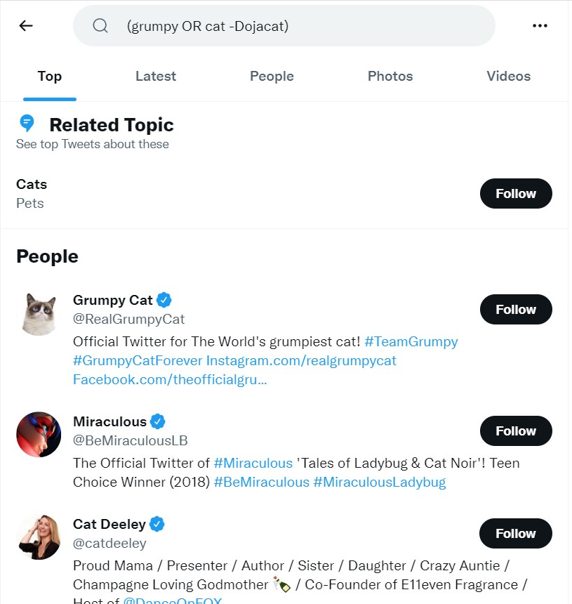

# Twarc Search Command

Returns tweets posted during the past 7 days that match a given query. We can put
in more than just one word, but for now let's stick with a previous one-word search.

Earlier we searched for 500 posts for #catsofinstagram. Now let's look for 2000.
Let's make a new cell in our Notebook and run a search command. Remember that we need to 
specify an output file. It is optional to use the `>` sign to signify the output file.

~~~
!twarc2 search --limit 2000 "(#catsofinstagram)" hashtag_cats.jsonl
~~~
{: .bash}

{: .image-with-shadow}

This command will search for any recent tweets that contain #catsofinstagram. Twarc 
tells me that I hit my limit of 2000 after checking back in after a few minutes. If
we had not limited our search and allowed twarc to gather 6-days' worth of tweets,
we would have used our entire download quota for the month.

We can use the visual indicator to confirm the limit of our second search. We may also 
open the file and see if we have something less than 2,000 tweets or 6 days worth. For 
this hashtag, you will probably hit your limit.

If you want to go back as far in time as the Twitter API allows (6 days typically),
and NOT eat up too much of your monthly quota, 
you can simultaneously tighten up your search parameters and keep your `--limit` value low.

~~~
!twarc2 search --limit 500 "(#catsofinstagram  #cute)" > hashtag_cats_500.jsonl
~~~

This adjusted search returns 5 out of six days. So asking for 800 Tweets should get me 
six days' worth of results.

~~~
!twarc2 search --limit 800 "(#catsofinstagram #cute)" > hashtag_cats_800.jsonl
~~~

In this way we can 'sip' at our quota and make sure we can work within the 500,000 tweet 
limit.

## Twitter Search

Twitter let's us get much more specific (or broad, if we want) with our searches. twarc 
search command uses the same search syntax as the search bar on your [Twitter home 
page](https://twitter.com/home)

We will demonstrate some options you may use when searching tweets in both the Twitter 
search bar and through the Twarc search command. First, you may search tweets for 
content that contains certain words. In the example image below, we search for tweets 
about Grumpy Cat. 

### AND logic

In the Twitter search bar, using all-caps `AND` will return tweets containing `grumpy` and `cat`. 

Successive operators with a space between them will result in boolean `AND` logic. Tweets separated by a space
will return tweets matching both conditions. In the example below, this search will return tweets containing `grumpy`
and `cat`

~~~
!twarc2 search "(grumpy cat)"
~~~

### OR Logic

To search for tweets that contain either word, and not require both words, the search bar and Twarc will
use a capitalized `OR` instead. This will return results if either search condition is met.
In this case, the terms, `grumpy` or `cat`. 

~~~
!twarc2 search "(grumpy OR cat)"
~~~

### Not Logic 

add a dash(-) to a keyword or operator to negate it (NOT). This works in both the twitter search bar and in twarc. 
This will match tweets containing the terms grumpy or cat, but omit anything about Doja Cat.  

~~~
!twarc2 search "(grumpy OR cat -Dojacat)"
~~~

### Searching twitters by users

The Twitter search and Twarc search command also supports looking for tweets that
mention a specified twitter account (mentioning another Twitter account in a tweet is
known as "at-ing/ @-ing" or "tagging"). In the below example, Jon @-ed the Twitter
account @ucsblibrary.

Note that capitalization for the account name does not affect the search.  Also, 
including the "@" symbol in front of the account name is not necessary, the search 
explicitly spells out the "to:" instead.

`to:` will match any tweet that is a reply to a partricular user. This can be the username or the numeric user ID. 
You can only pass a single username/ID per `to:` command. 

~~~
!twarc2 search "(to:ucsblibrary)"  
~~~

### Using Hashtags
As we have seen before, we may also search tweets that contain hastags. In the example 
below, notice that the resulting tweet also contains other hashtags that we did not 
explicitly search for.

~~~
!twarc2 search "(#meme)"
~~~

### Order of Operations
We have seen individual searches of each of these parameters. You may also combine these parameters to narrow down your results.
When combining boolean functions the following order of operations will dictate how your query is evaluated. 

1. Operators connected by `AND` logic are combined first
2. Operators connected by `OR` logic are combined after

For Example, internet cats Cole and Marmalade:

 
`cats OR cole marmalade` would be evaluated as `cats OR (cole marmalade)` 
`cats cole OR marmalade` would be evaluated as `(cats cole) OR marmalade` 

To eliminate uncertainty, you can use parentheses to group terms together where appropriate. 
With Cole and Marmalade 

`(cats or cole) marmalade` which would probably throw out cats, some guy named Cole, and orange preservatives
`cats (cole marmalade)` which would be closer to our internet cats

~~~
!twarc2 search "(grumpy cat #meme)"
~~~

> ## Challenge: Advanced Twarc Search
>
> What resulting tweet(s) do you get from using the Twarc search command?
> ~~~
> twarc2 search "(grumpy cat) (#meme) (#cute)"
> ~~~
> {: .language-bash}
>
> Can you think of interesting search parameters for tweets?  If so, use Twitter search
> or Twarc search to try them out.
{: .challenge}

## Twarc Stream Command

You may also collect tweets as they are posted, and establish rules to what tweets will 
be collected (as you did for setting search parameters). To start with a stream, let's 
set some tweet parameters or rules:

You may want to see 'what's trending' on Twitter to make sure you 
get a good number of results here.

~~~
!twarc2 stream-rules add "#catsofinstagram"
~~~

~~~
🚀  Added rule for "#catsofinstagram"
~~~
{: .output}

~~~
!twarc2 stream-rules add "fluffy"
~~~

~~~
🚀  Added rule for "fluffy"
~~~
{: .output}

To see what your current stream rules are, you may list them:

~~~
!twarc2 stream-rules list
~~~

~~~
☑  #catsofinstagram
☑  fluffy
~~~
{: .output}

You may stream tweets that contain words and hashtags like we had done in Twarc search. We cannot use a username to stream tweets that mention another Twitter account:

~~~
!twarc2 stream-rules add "at:_We_Rate_Cats"
~~~

~~~
💣  UnprocessableEntity see: https://api.twitter.com/2/problems/invalid-rules
~~~
{: .output}

When you start collecting tweets with the rules you have set in place, you must create the file that the data will be stored in:

~~~
!twarc2 stream > "raw_data/streamed_tweets.jsonl"
~~~

Once this command is run, you will collect tweets that match the rules set in place.

This collection will be ongoing unless you explicitly shut down the stream by 
interrupting the kernel (in Jupyter) or by typing a `ctrl + c` (from the console). While 
this stops the stream collection, it does not remove the stream-rules. In order to 
remove the rules you had set in place, you must use delete:

~~~
!twarc2 stream-rules delete ""#catsofinstagram"
!twarc2 stream-rules delete "fluffy"
~~~

> ## Discuss: Search vs Stream
> We had an introductory look at the use of the search command and the stream command.
> Please brainstorm what the difference(s) are between searching tweets and streaming tweets.
> When might you choose stream over search? How can you use them together?
{: .discussion}

Here is more [clarification](https://scholarslab.github.io/learn-twarc/06-twarc-command-basics).

Functions and utilities: refer to our guide and readthedocs.docnow. There will be more detail in episode 6.
Functions / extensions: can be pip installed --and these installs stick in our Labs environment (because we
have permission to install things on top of twarc)

Our twitter guide gives advice about how to follow a real-time event, like pending #scotus decisions.
