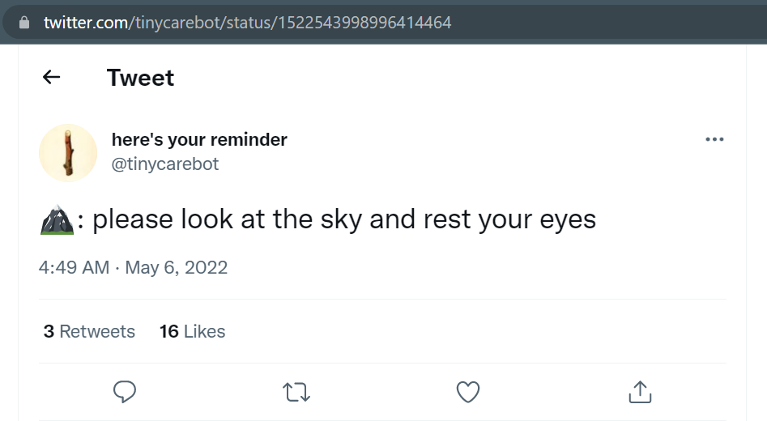
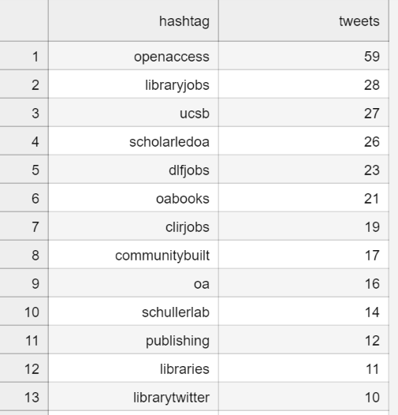

# Other Harvests
Twarc2 has commands to retrieve entire conversation threads, as well as the
retweets of one or more tweets. Recall that a retweet is when a
Twitter account shares the Tweet of a different Twitter account.

This tweet has three retweets. We can retrieve those:

We will need to get the tweet's numeric identifier. We
can see the tweetID by looking at the url of the tweet. In this case, the tweet's ID
is 1522543998996414464.

~~~
!twarc2 retweeted-by 1522543998996414464 > 'raw_data/tinycarebot_rtby.jsonl'
~~~
{: .language-bash}

This gives us the profiles of the three twitter accounts . From there
we can go on to harvest their timelines to see what they are up to.

## How much original content?
You might be surprised by how much of your dataset consists purely of retweets--
people pushing that one button and not doing anything else.

We can use a little bit of python to calculate the proportion:

~~~
retweet_count = hashtagcats_df["referenced_tweets.retweeted.id"].value_counts()
sum(retweet_count)

(sum(retweet_count) / len(hashtagcats_df))
~~~
{: .python}

This is such a useful measure that we often calculate this value as part
of our initial workflow.

> ## Challenge
> How much of Bergis Jules timeline is original content?
> How about the UCSB Library's timeline?
{: .challenge}

## Followers
Not only can we see everyone who has retweeted another tweet, we can also
find all the followers of a given account.

@tinycarebot is very popular, so let's get just a few of their followers. The
limiter here is counted in thousands, so we are getting 1000 of
@tinycarebot's followers:

~~~
!twarc2 followers --limit 1 tinycarebot >  'raw_data/tcb_followers.jsonl'
~~~
{: .language-bash}

> ## Challenge: Do robots follow robots?
> Take a look at the first bunch of user profiles we just downloaded.
> Do you think that any of them might be robots?
> You should flatten the file. And we can't make a csv of this one
> because csv only works on tweets, not users.
>
> > ## Solution
> > ~~~
> > !twarc2 csv 'raw_data/tcb_followers.jsonl' > 'output_data/tcb_followers.csv'
> > ~~~
> >
> > Convert the 5 profile files into a csv and read them
> > You might also need to copy-and-paste the user-id
> > into the Twitter web interface and take a look at the media
> > that comes along.
> {: .solution}
{: .challenge}

### twarc2 Plus-ins
When we have thousands
of tweets, there's some obvious tasks that we can do to get a grip on them.
Anticipating those tasks, Doc the Now has
created [twarc2 plugins](https://twarc-project.readthedocs.io/en/latest/plugins/)
to help get this work done.

twarc2 plug-ins, like csv that we did earlier, need to be installed separately.
In this episode, we will look at twarc-hashtags and twarc-network

First you need to `pip install` in BASH

~~~
!pip install twarc-hashtags
!pip install twarc-network
~~~
{: .language-bash}

### Most seen hashtags
When we run hashtags on our `hashtagcats` dataset, we should see the hashtag
we search for first. Our other results make sense as well. We see a lot of dogs and Japanese
cropping up. In case you didn't know it, Internet cats are huge in Japan.

#### Top hashtags
~~~
!twarc2 hashtags 'raw_data/hashtagcats.jsonl' > 'output_data/hashtagcats_hashtags.csv'
~~~
{: .language-bash}

> ## Challenge: Look for surprises
>
> Run the hashtags plug-in on the @tinycarebot dataset.
>
> Are there tags that surprised you?
> Look at that individual tweet and figure out if that context helps you
> understand why that unanticipated hashtag is there.
>
> > ## Solution
> >
> > I looked at people who mentioned UCSB Library.
> >
> > ~~~
> > !twarc2 hashtags output_data/ #FIXME
> > 
> > ~~~
> > {: .output}
> >
> > #FIXME what sort of challenge can we have?
> > library mentions got nuked because nobody tweets @at the library
> >
> >
> {: .solution}
{: .challenge}

## Network Graphs

We call network the same way we called hashtags

~~~
!twarc2 network 'raw_data/hashtagcats.jsonl' > 'output_data/hashtagcats_network.html'
~~~
{: .language-bash}

The built-in web viewer ain't so hot, so download that html file to view the
network on your own computer. Chrome works fine, and it's best to make the diagram
fullscreen. It mseems to work better on a
PC than a mac. We can see: - the largest central cluster around the account
@catsofinstagram

- a corporate entity (a litter box company?) shows up,

- some users of the hashtag are separate from the account's network.

- neighborhoods of users exist, such as those around kiko1123215 in the
  image below. Kiko is nearby, but separate from, the
  @catsofinstagram twitter account.

> ## Challenge: Examining a network diagram
>
> Create a network diagram of the ecodatascience timeline
>
> ~~~
> it may include some code
> ~~~
> {: .source}
>
> > ## Solution
> >
> > Because this is a timeline, the network is completely one-dimensional.
> > We think any timeline would look like this.
> >
> > ~~~
> > !twarc2 network 'raw_data/ecodatasci.jsonl' > 'output_data/ecodatasci_network.html'
> > ~~~
> > {: .language-bash}
> {: .solution}
{: .challenge}
